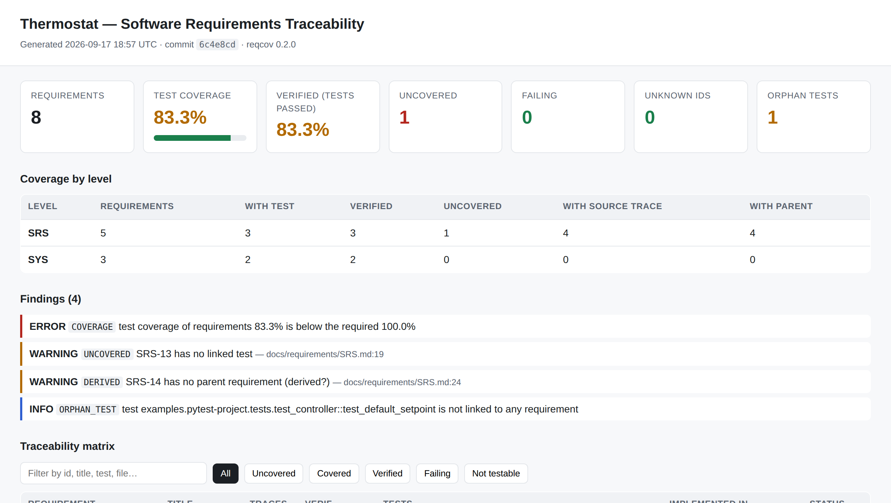
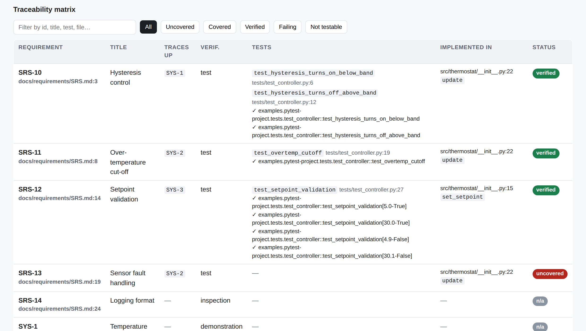

# reqcov — requirements coverage for pull requests

**Codecov, but for your requirements.** reqcov reads the requirements you already keep in your
repository (Markdown, YAML, Doorstop, or a ReqIF export from DOORS / Polarion), finds the tests and code that reference them, merges
the JUnit results of your test run, and tells every pull request which requirements are
**uncovered**, **covered**, **verified** or **failing** — then writes the traceability matrix an
auditor asks for (IEC 62304, ISO 26262, EN 50128, DO-178C, IEC 61508, ECSS).

No server, no account, no new editor: a CLI + a GitHub Action.

[](https://pypi.org/project/reqcov/)
[](https://github.com/Antoine005/reqcov/actions/workflows/ci.yml)
[](https://github.com/marketplace/actions/reqcov-requirements-coverage)
[](LICENSE)

> A hosted version with coverage history, badges and a signed PDF for audit packages is
> planned. [Join the waitlist](https://tally.so/r/Me4K28) if your team would use it.

**[▶ See a live report](https://antoine005.github.io/reqcov/)** — the real output for the Python,
C and C++ examples below, regenerated on every push. Nothing to install.

[](https://antoine005.github.io/reqcov/pytest-project/index.html)

The matrix is filterable by status, every requirement links back to its source line, and every
test links to the file that references it:

[](https://antoine005.github.io/reqcov/pytest-project/index.html)

On a pull request the same run becomes one sticky comment:

```text
## ❌ Requirements coverage: 83.3%

| Requirements | With test | Verified | Uncovered | Failing | Unknown ids | Orphan tests |
|---:|---:|---:|---:|---:|---:|---:|
| 8 | 5 | 5 | 1 | 0 | 0 | 1 |

- SRS: 75% of 4 testable requirements have a test
- SYS: 100% of 2 testable requirements have a test

### ❌ 1 error(s)
- `COVERAGE` test coverage of requirements 83.3% is below the required 100.0%
```

## How it works

1. **Requirements** live in your repo, one id per requirement (`SYS-1`, `SRS-12`, `LLR-3`…):

   ```markdown
   ## SRS-11 — Over-temperature cut-off
   The controller shall force the heater off when temperature ≥ 35 °C.
   Parent: SYS-2
   Verification: test
   ```

   YAML lists, [Doorstop](https://github.com/doorstop-dev/doorstop) items and
   [ReqIF](#reqif-doors-polarion-codebeamer) exports are also read.

2. **Tests and code** reference ids with a marker — any language, in a comment, a decorator, a
   macro:

   ```python
   @pytest.mark.req("SRS-11", "SYS-2")
   def test_overtemp_cutoff(): ...
   ```

   ```c
   /* @req LLR-12 */
   void test_frame_bad_crc_is_rejected(void) { ... }

   /* @implements LLR-11, LLR-12 */
   frame_status_t frame_validate(const uint8_t *frame, size_t len) { ... }
   ```

   ```cpp
   // @verifies SWR-2
   TEST(RingBuffer, PushOnFullFails) { ... }
   ```

3. **JUnit XML** (pytest, Ceedling, GoogleTest, CTest, Jest, Maven…) turns *covered* into
   *verified* or *failing*.

4. **Rules** in `reqcov.yml` decide what fails the build: minimum coverage, unknown ids,
   orphan tests, mandatory parent links per level, mandatory `@implements` per level.

## Quick start

```bash
pip install reqcov
reqcov init                       # writes reqcov.yml — edit the globs
pytest --junitxml=reports/junit.xml
reqcov check                      # exit 1 on rule violations, writes reqcov-report/
open reqcov-report/index.html
```

`reqcov-report/` contains `index.html` (interactive matrix), `matrix.csv` (auditor-friendly),
`coverage.json` (machine readable, [versioned format](docs/coverage-json.md)) and `summary.md`
(the PR comment). Add `pdf` and `reqif` to
`report.formats` (or pass `-f pdf -f reqif`) for `matrix.pdf` and `requirements.reqif`.

## GitHub Action

```yaml
name: requirements
on: [pull_request, push]
jobs:
  reqcov:
    runs-on: ubuntu-latest
    permissions:
      contents: read
      pull-requests: write
    steps:
      - uses: actions/checkout@v4
      - run: pip install -e . pytest && pytest --junitxml=reports/junit.xml
      - uses: Antoine005/reqcov@v0
        with:
          junit: reports/junit.xml
```

The action posts (and keeps updating) one sticky comment on the pull request, writes the
summary to the job page, emits annotations on the requirement lines that are uncovered or
failing, and uploads the report directory as an artifact.

## Coverage delta on pull requests

With `--base-ref`, reqcov analyses the base commit in a temporary git worktree and reports what
the pull request changed:

```text
## ✅ Requirements coverage: 100.0% (▲ +12.5% vs `a1b2c3d`)
### Changes vs base
- Improved (1): **SRS-13** uncovered → covered
- New (1): **SRS-15** Sensor calibration (covered)
```

```bash
reqcov check --base-ref origin/main          # compare against a branch
reqcov check --baseline previous/coverage.json
```

The Action does this automatically on pull requests (`compare-base: "true"`). A requirement that
loses its test raises `REGRESSION`, a lower percentage raises `COVERAGE_DROP`; both are warnings
unless `rules.fail_on_coverage_drop` is true. The delta compares static links only, because the
base commit's tests were not run.

## GitLab CI

```yaml
# see examples/gitlab-ci.yml for the full template
requirements:
  image: python:3.12
  script:
    - pip install reqcov
    - pytest --junitxml=reports/junit.xml || true
    - reqcov check --base-ref "origin/$CI_MERGE_REQUEST_TARGET_BRANCH_NAME"
  artifacts:
    when: always
    paths: [reqcov-report/]
```

## ReqIF (DOORS, Polarion, codebeamer...)

Point `requirements` at a `.reqif` file or a `.reqifz` archive exported from your requirements
tool; it is read next to your Markdown or YAML files.

```yaml
requirements: [docs/requirements/**/*.md, exports/SRS.reqifz]
reqif:
  id_prefix: "SRS-"          # DOORS exports the absolute number: "SRS-" + "12" → SRS-12
  # several modules in one export: one prefix per module (SPECIFICATION name)
  # id_prefix: {"System Requirements": "SYS-", "Software Requirements": "SRS-"}
  id_attribute: ""           # attribute holding the id (default: ReqIF.ForeignID, ID, ...)
  relation_types: []         # link types that mean "parent" (default: all)
  parent_end: target         # DOORS "satisfies" links point from child (source) to parent (target)
```

Attributes are matched by name, case-insensitively: `ReqIF.Name` / `ReqIF.ChapterName` → title,
`ReqIF.Text` → text, and the same `Verification` / `Status` / `Tags` / `Jira` fields as below.
Chapter headings are skipped. Enumerations and XHTML text are resolved.

The other way round, `-f reqif` writes `requirements.reqif` (valid against the OMG ReqIF
schema): the requirements with their parent relations and the coverage of the run as `reqcov.*`
attributes (`reqcov.Coverage`, `reqcov.Tests`, `reqcov.Results`...), ready to import back into
the tool your quality team works in. Requirements that came from a ReqIF file keep their original
object identifiers, so the tool can match them with its own objects; how an import updates
existing objects is up to that tool's import settings.

## PDF for the audit package

`-f pdf` writes `matrix.pdf`: the summary, coverage by level, findings, the change against the
base branch, a sign-off table and the full matrix with its header repeated on every page — the
document that goes into the DHF or the safety case. No extra dependency: it is generated with
the Python standard library.

## Jira links

```markdown
## SRS-11 — Over-temperature cut-off
Parent: SYS-2
Jira: THERM-42, THERM-57
```

```yaml
jira:
  url: https://your-company.atlassian.net
```

The keys become links in the HTML report and the PR comment, and are exported in `matrix.csv`,
`coverage.json`, the PDF and the ReqIF export. `Issue:` and `Ticket:` work too; without
`jira.url` the keys are shown as plain text.

## Adopting reqcov on an existing project

Requirements in DOORS, issues in Jira, years of tests that reference neither: start by
measuring, then stop regressions, then raise the bar.

1. **Read the requirements where they are.** Export the DOORS modules as ReqIF, commit the
   `.reqifz`, point `requirements` at it and set `reqif.id_prefix`. `reqcov list` shows what
   was read. Keep the Jira key as a DOORS attribute (`Jira`) to get the links in every report.
2. **Report without blocking.** Run the Action with `fail-on-error: "false"`, or:
   ```yaml
   rules:
     min_test_coverage: 0          # start from what exists
     fail_on_coverage_drop: true   # ratchet: a pull request may not lower coverage
     fail_on_unknown_ids: true     # a mistyped marker fails at once
   ```
   On pull requests the Action compares with the base branch (on by default), so from there on
   coverage cannot go down.
3. **Mark tests where it matters first**: safety requirements, then the code that changes most.
   A test that cites a Jira key instead of a requirement id (`@req THERM-42`) is reported as an
   unknown id that names the requirements linked to that issue.
4. **Raise `min_test_coverage`** level by level once the ratchet has done its work.

Nothing here writes to DOORS or Jira, and no step needs a server or a token: everything is
computed from the commit.

## Configuration (`reqcov.yml`)

```yaml
id_pattern: "[A-Z][A-Z0-9_]*-\\d+"   # level = everything before the last dash
requirements: [docs/requirements/**/*.md]
sources:      [src/**/*]              # scanned for @implements markers
tests:        [tests/**/*]            # scanned for @req / @verifies markers
junit:        [reports/*.xml]
markers: [req, requirement, implements, verifies, satisfies, trace]
rules:
  min_test_coverage: 100        # % of testable requirements with ≥ 1 test
  min_verified: null            # % that must be verified (needs junit)
  fail_on_unknown_ids: true
  fail_on_orphan_tests: false
  fail_on_failing_tests: true
  require_parent_for: [SRS]     # levels that must trace up
  require_source_for: []        # levels that must have an @implements
  allow_derived: true           # missing parent = warning (false: error)
  fail_on_coverage_drop: false  # with --base-ref: regression = error
report:
  out_dir: reqcov-report
  formats: [html, csv, json, md]  # + pdf, reqif
  title: "Software Requirements Traceability"
jira:
  url: https://your-company.atlassian.net
```

### Requirement metadata

| Field | Markdown body line | YAML key | Values |
|---|---|---|---|
| parents | `Parent: SYS-1, SYS-2` | `parent` / `parents` / `links` | ids |
| verification | `Verification: test` | `verification` | `test` (default), `analysis`, `inspection`, `demonstration`, `none` |
| status | `Status: draft` | `status` (Doorstop: `active: false` → obsolete) | free text; `obsolete` is ignored by rules |
| tags | `Tags: safety, ui` | `tags` | list |
| jira | `Jira: PROJ-12, PROJ-14` | `jira` / `issues` / `tickets` | issue keys |

Only requirements with `verification: test` count toward test coverage; the others are shown
as `n/a` in the matrix so the auditor still sees them.

## Examples

Every report below is [published live](https://antoine005.github.io/reqcov/) — open one before
installing anything.

| Example | Stack | What it shows | Live report |
|---|---|---|---|
| [`examples/pytest-project`](examples/pytest-project) | Python, pytest | SYS→SRS levels, one deliberate gap and one orphan test | [open](https://antoine005.github.io/reqcov/pytest-project/index.html) |
| [`examples/ceedling-unity`](examples/ceedling-unity) | C, Ceedling/Unity | HLR→LLR, `@implements` in sources, a failing test propagating to two requirements | [open](https://antoine005.github.io/reqcov/ceedling-unity/index.html) |
| [`examples/googletest`](examples/googletest) | C++, GoogleTest | one-line requirements, `Suite.Name` results | [open](https://antoine005.github.io/reqcov/googletest/index.html) |
| [`examples/gitlab-ci.yml`](examples/gitlab-ci.yml) | GitLab CI | merge-request delta and report artifact | — |

## Status and roadmap

`0.1` — CLI, Markdown/YAML/Doorstop input, marker scanning, JUnit merge, HTML/CSV/JSON/MD
reports, GitHub Action with sticky PR comment.
`0.2` — coverage delta against the base branch, GitLab CI template.
`0.3` — ReqIF import and export, Jira issue links, PDF export.
Planned: hosted history and badges, signed and timestamped PDF, StrictDoc input.

## Read more

- [An IEC 62304 traceability matrix from GitHub Actions in 15 minutes](docs/blog/iec-62304-traceability-matrix-github-actions.md)

## License

MIT.
